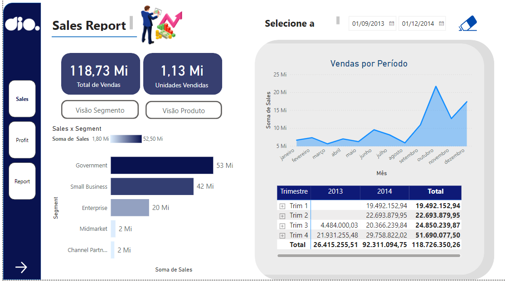
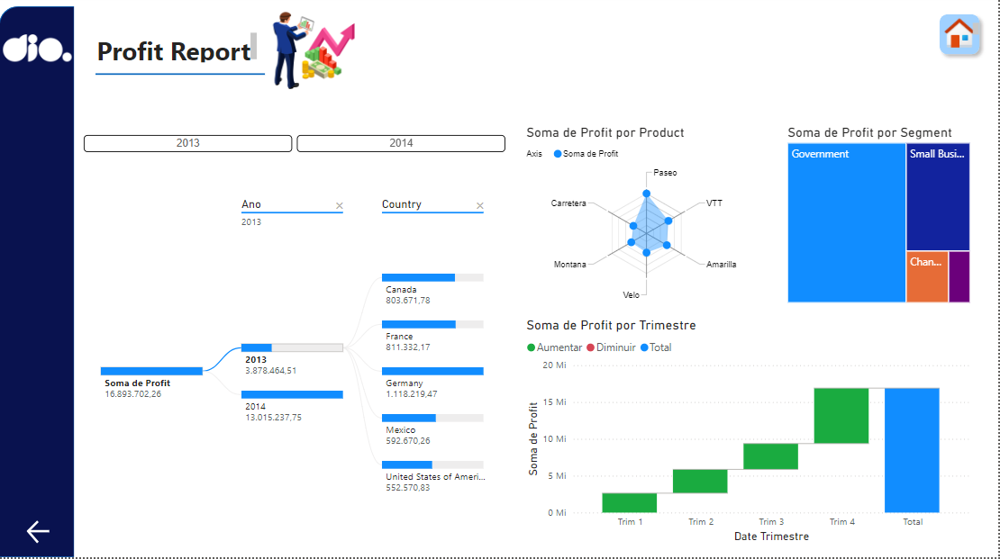
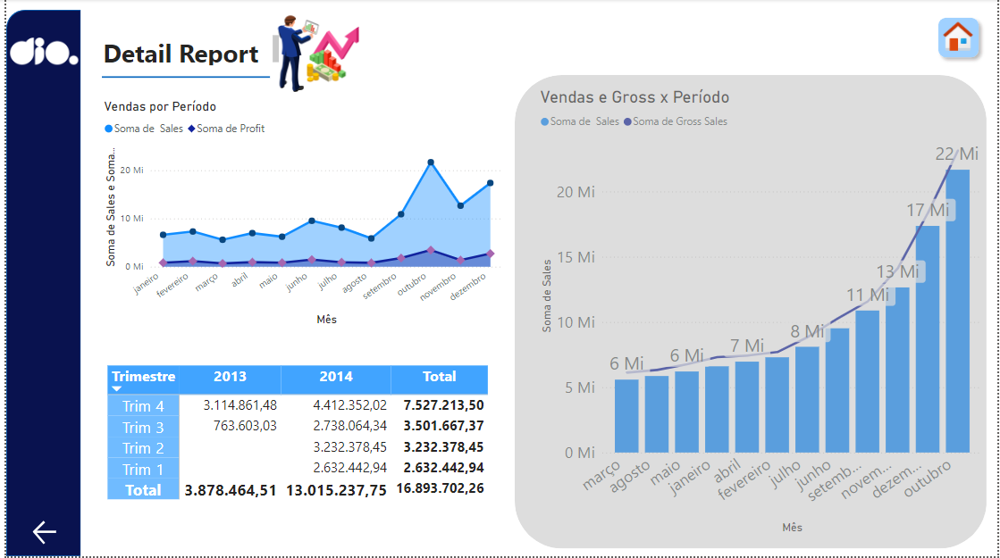

# Desafio Power BI - Módulo 6 DIO - Dashboard Gerencial

No desafio "Criando um Dashboard Gerencial para Tomada de Decisões Com Power BI"
do módulo "Data Analytics & Storytelling com Power BI" do Bootcamp "Data Analytics com Power BI" foi alterado o layout de um painel previamente feito em outro módulo. Ao todo foi alterado o layout de 3 relatórios.

A modelagem ficou da seguinte forma:

Neste repositório se encontra o arquivo do Power Bi com a modelagem feita no formato proposto.

